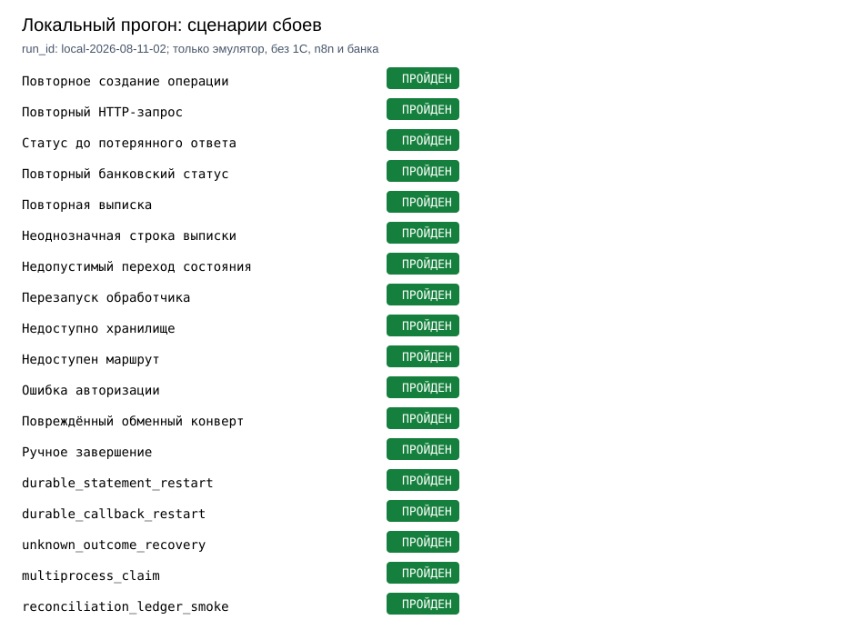

# Платёжный контур 1С

[](https://github.com/sergey-lastochkin/payment-integration-control-plane/actions/workflows/ci.yml)

Проект посвящён платежам, которые формируются по заявкам в 1С:УПП и передаются во внешний банковский контур.



Локально проверяю повторные запросы и восстановление после сбоев: что произойдёт, если ответ потерялся, банковский статус пришёл дважды, выписку загрузили повторно или одну строку можно сопоставить с несколькими платежами. Идентификаторы выписки и callback сохраняются в SQLite, поэтому duplicate suppression переживает reopen/restart; `outcome_unknown` после отправки не приводит к слепому повтору внешнего вызова.

Новый прогон содержит 18 сценариев. Он подтверждает один `operation_id` для повтора, сохранение более сильного статуса, durable replay protection после reopen и один успешный claim из двух независимых процессов. Результаты по каждому сценарию лежат в [summary.json](failure_lab/runs/local-2026-08-11-02/summary.json); прошлый run сохранён для истории.

Этот прогон выполнен локально. Подключение к тестовой УПП, n8n и банковскому каналу здесь не проверялось.

[Жизненный цикл](docs/payment-lifecycle.md) · [Сверка выписки](docs/reconciliation.md) · [Сценарии сбоев](docs/failure-model.md) · [Подготовка реального прогона](real_run/README.md)

## Что происходило в локальном прогоне

| Сценарий | Зафиксированный результат |
|---|---|
| Два одинаковых HTTP-запроса | Одна операция и один файл локального outbox |
| Статус пришёл до ответа отправителя | `accepted` не заменяется слабым `sent` |
| Повторный статус | В аудите остаётся одна запись `accepted` |
| Повторная выписка после reopen | Вторая строка возвращается с `replayed=true` из SQLite ledger |
| Неоднозначная выписка | Два кандидата, требуется ручная проверка |
| Потерянный ответ после send | После restart операция становится `outcome_unknown`; перед повтором нужны status lookup, сверка или ручное решение |
| Два независимых worker | Только один получает send claim и создаёт локальный outbox-файл |
| Ручное решение | Финальный статус получает источник `manual_resolution` |

Таблица составлена из [summary.json](failure_lab/runs/local-2026-08-11-02/summary.json). Это не данные УПП, n8n или банка.

## Следующий тестовый прогон

В [real_run](real_run/README.md) подготовлены десять шагов: заявка и платёжное поручение в тестовой УПП, проверка дубля, HTTP-сервис 1С, тестовый n8n workflow, bank emulator, возврат статуса и его повтор. `evidence.py` создаёт журнал прогона с `run_id`, временем, commit SHA, версиями 1С и конфигурации, request id, `operation_id`, id n8n, переходами, длительностью, ошибками и итогом подавления дубля.

Папка с фактическими скриншотами, трассировками и HTTP-подтверждениями игнорируется Git. Пока тестовый контур не предоставлен, состояние честно остаётся `REAL_RUN_BLOCKED`.

## Как повторить локальную проверку

```bash
python -m venv .venv
.venv/bin/pip install -e '.[dev]'

PYTHONPATH=src .venv/bin/python -m pytest
PYTHONPATH=src .venv/bin/python failure_lab/run.py \
  --run-id local-YYYY-MM-DD-01
PYTHONPATH=src .venv/bin/python failure_lab/restart_demo.py
PYTHONPATH=src .venv/bin/python failure_lab/render_report.py \
  --summary failure_lab/runs/local-YYYY-MM-DD-01/summary.json \
  --output-dir failure_lab/runs/local-YYYY-MM-DD-01/report
ruff check src tests failure_lab real_run
```

`run.py` создаёт временные SQLite и файлы банковского конверта во временном каталоге, затем удаляет их. В `runs/` остаются JSON-результаты и графические отчёты.
`restart_demo.py` отдельно показывает переход `sending → outcome_unknown` после restart и ноль новых внешних send без явной политики восстановления.

## Проверено автоматически

CI устанавливает проект в чистом Python-окружении, запускает `pytest`, `ruff`, `compileall` и отдельный локальный прогон 18 сценариев сбоев, включая restart и multiprocessing claim. Этот прогон не подключается к 1С, n8n или банку.

## Пока не проверено в интеграционной среде

- BSL-файл в `bsl/` показывает точки интеграции и переходы, но не запускался в тестовой УПП.
- Реальные n8n workflow, банковские API, DirectBank и штатный обмен 1С не проверялись.
- В репозитории нет документов клиента, счетов, ИНН, КПП, адресов серверов, токенов и ключей.
- Для тестового прогона нужны обезличенная УПП, тестовый маршрут n8n, безопасный bank emulator и отдельное разрешение на публикацию очищенных скриншотов.
