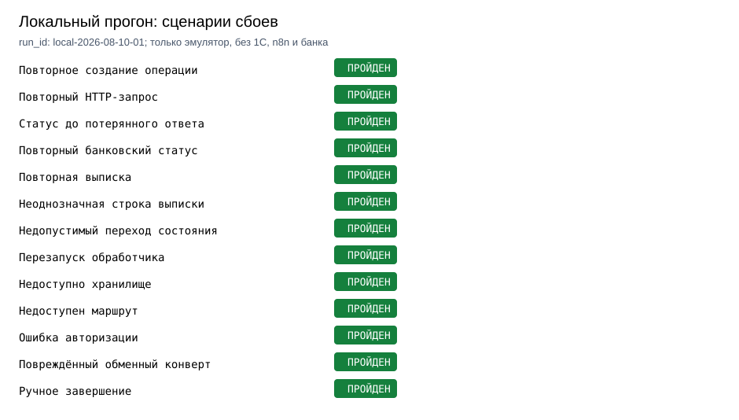

# Платёжный контур 1С

Локальная модель обработки платежа от заявки в 1С:УПП до банковского маршрута и обратного статуса. Код фиксирует идентификатор бизнес-операции до внешнего вызова, не отправляет платёж повторно после неопределённого результата и выносит спорные выписки на ручную проверку.



Локальный прогон проверил 13 сценариев: повторное создание, повторный HTTP-запрос, статус до ответа отправителя, повторные статусы и выписки, неоднозначная сверка, рестарт, ошибки хранилища и маршрута, auth error, повреждённый конверт и ручное завершение. Исходный результат сохранён в [summary.json](failure_lab/runs/local-2026-08-10-01/summary.json), по одному JSON на сценарий.

Это уровень C: запуск не подключался к УПП, n8n, банку, RabbitMQ или PostgreSQL. Скриншотов 1С и n8n нет, потому что обезличенная тестовая база и тестовый маршрут пока не предоставлены.

[Жизненный цикл](docs/payment-lifecycle.md) · [Сверка выписки](docs/reconciliation.md) · [Сценарии сбоев](docs/failure-model.md) · [Эксплуатационные границы](docs/operations.md)

## Как проходит операция

1. В заявке на оплату в УПП сохраняется ссылка на исходный документ.
2. Исходящее платёжное поручение получает тот же `operation_id` и связь с заявкой.
3. n8n выбирает маршрут банка: API, DirectBank, штатный обмен 1С или файл.
4. Отправитель фиксирует состояние `sending` до внешнего вызова.
5. Банк или выписка возвращают статус. Повторный callback определяется по `event_id`.
6. При равных кандидатах сверки операция остаётся в `manual_check`; оператор завершает её только с причиной.

Схема переходов строится скриптом из `TRANSITIONS`: [status-model.mmd](failure_lab/runs/local-2026-08-10-01/report/status-model.mmd).

## Что показал прогон

| Сценарий | Сохранённое подтверждение |
|---|---|
| Два одинаковых HTTP-запроса | Одна попытка и один файл локального outbox |
| Callback пришёл до ответа отправителя | Статус `accepted` не перезаписан на более слабый `sent` |
| Повторный callback | В аудите одна запись `accepted` |
| Повторная выписка | Вторая строка отмечена `replayed=true` |
| Неоднозначная выписка | Два кандидата, состояние `manual_check` |
| Недоступный маршрут или auth error | Операция остаётся `sending`, до повтора нужна сверка |
| Ручное решение | Переход в terminal status получает источник `manual_resolution` |

Таблица – краткое изложение [summary.json](failure_lab/runs/local-2026-08-10-01/summary.json), а не отдельные ручные измерения.

## Как повторить локальную проверку

```bash
python -m venv .venv
.venv/bin/pip install -e '.[dev]'

PYTHONPATH=src .venv/bin/python -m pytest
PYTHONPATH=src .venv/bin/python failure_lab/run.py \
  --run-id local-YYYY-MM-DD-01
PYTHONPATH=src .venv/bin/python failure_lab/render_report.py \
  --summary failure_lab/runs/local-YYYY-MM-DD-01/summary.json \
  --output-dir failure_lab/runs/local-YYYY-MM-DD-01/report
ruff check src tests failure_lab
```

`run.py` создаёт временные SQLite и файлы банковского конверта внутри временного каталога и удаляет их после сценария. В `runs/` остаются только JSON-результаты и графические отчёты.

## Ограничения текущего этапа

- BSL-файл в `bsl/` описывает точки интеграции и переходы, но не запускался в тестовой УПП.
- Реальный n8n workflow, банковские API, DirectBank и штатный обмен 1С не проверялись из этого репозитория.
- Тестовые реквизиты вымышлены. В репозитории нет клиентских документов, счетов, ИНН, КПП, адресов серверов, токенов или ключей.
- После появления тестового контура нужны отдельные обезличенные скрины заявки и платёжного поручения, трассировка n8n, журнал статусов и проверка маршрута до банка.
