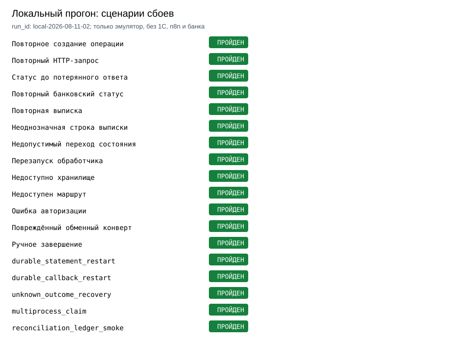

# Платёжный контур 1С: повторы, статусы, сверка

[](https://github.com/sergey-lastochkin/payment-integration-control-plane/actions/workflows/ci.yml)

**Эталонная реализация надёжного обмена «1С → n8n → банк → статус обратно в 1С».**
Показывает, как не отправить платёж дважды и не потерять его статус, когда сеть,
банк или воркер ведут себя плохо.



## Какую проблему решает

Простой сценарий «отправили платёжку — пометили оплаченной» ломается на
реальных сбоях: ответ банка потерялся после отправки, статус пришёл дважды или
раньше ответа, выписку загрузили повторно, одна строка выписки подходит к
нескольким платежам. Итог — двойные платежи или ложный статус «исполнено».

Здесь бизнес-операция отделена от попытки доставки:

- у каждой платёжки один `operation_id`, повторный запрос не создаёт вторую отправку;
- статусы меняются только по разрешённым переходам (одна спецификация для Python и BSL);
- после сбоя «ответ не получен» операция становится `outcome_unknown` — повтор
  возможен только после запроса статуса, сверки или ручного решения;
- входящие callback и строки выписки хранятся в SQLite и не применяются повторно
  даже после перезапуска.

## Для кого

- Компании на 1С, где платёжки из заявок уходят в банк через интеграционный слой
  (n8n, свой сервис, DirectBank) и нужен контроль повторов и статусов.
- 1С-разработчики и интеграторы, которым нужна готовая модель статусов и набор
  сценариев сбоев для своих тестов.

## Запуск за 2 минуты

```bash
git clone https://github.com/sergey-lastochkin/payment-integration-control-plane.git
cd payment-integration-control-plane
python3.11 -m venv .venv
.venv/bin/pip install -e '.[dev]'

PYTHONPATH=src .venv/bin/python -m pytest -q
PYTHONPATH=src .venv/bin/python failure_lab/run.py --run-id local-demo-01
PYTHONPATH=src .venv/bin/python failure_lab/restart_demo.py
```

`run.py` прогоняет 18 сценариев сбоев во временном каталоге и печатает
`{"run_id": "local-demo-01", "passed": 18}`; JSON по каждому сценарию остаётся в
`failure_lab/runs/local-demo-01/`. `restart_demo.py` показывает переход
`sending → outcome_unknown` после перезапуска и ноль повторных отправок.
SVG-отчёт строит `failure_lab/render_report.py`.

Полный HTTP-маршрут с n8n (нужен Docker) (n8n `1.82.3`, control plane и bank emulator):

```bash
PYTHONPATH=src .venv/bin/python real_run/local_stack/run_e2e.py \
  --run-id local-n8n-demo-01 \
  --public-output real_run/runs/local-n8n-demo-01/summary.json
```

## Пример результата

Сохранённый прогон [local-2026-08-11-02](failure_lab/runs/local-2026-08-11-02/summary.json) —
18 из 18 сценариев пройдены:

| Сценарий | Что зафиксировано |
|---|---|
| Два одинаковых HTTP-запроса | Одна операция и один файл в outbox |
| Статус пришёл до ответа отправителя | `accepted` не затирается более слабым `sent` |
| Повторный статус банка | В аудите одна запись `accepted` |
| Повторная выписка после перезапуска | Вторая строка возвращается с `replayed=true` из SQLite |
| Неоднозначная выписка | Два кандидата → ручная проверка |
| Потерян ответ после отправки | После перезапуска `outcome_unknown`, слепого повтора нет |
| Два независимых воркера | Отправку получает только один |
| Ручное решение | У финального статуса источник `manual_resolution` |

HTTP-прогон через n8n ([summary.json](real_run/runs/local-n8n-bank-2026-08-11/summary.json)):
8 из 8 сценариев — обычный маршрут, повторная отправка, задержка ответа,
callback раньше ответа, повторный и конфликтующий callback, потеря ответа после
фиксации в банке с восстановлением через запрос статуса.

Устройство: [жизненный цикл](docs/payment-lifecycle.md) ·
[сверка выписки](docs/reconciliation.md) · [модель сбоев](docs/failure-model.md) ·
[ADR](docs/adr/) · [n8n-прогон](docs/real-integration-validation.md)

## Ограничения

- Банк здесь — эмулятор. Реальные банковские API, DirectBank и штатный обмен 1С
  не подключались; адаптер реального банка нужно писать под его контракт.
- `bsl/PaymentIntegration.bsl` — иллюстрация точек интеграции для синтетической
  конфигурации. Имена метаданных нужно сопоставить с вашей базой; в 1С модуль
  не запускался.
- SQLite рассчитан на один узел. Для нескольких серверов нужна общая БД.
- Весы сопоставления выписки эвристические и не откалиброваны на реальных данных.
- Все реквизиты в тестах вымышлены; документов, ИНН, счетов, адресов серверов и
  ключей в репозитории нет.

## Автор и контакты

Сергей Ласточкин — интеграции 1С с банками и внешними сервисами.
Нужно довести платёжный обмен до надёжного состояния в вашей базе — пишите в
Telegram [@metaanswer](https://t.me/metaanswer).
